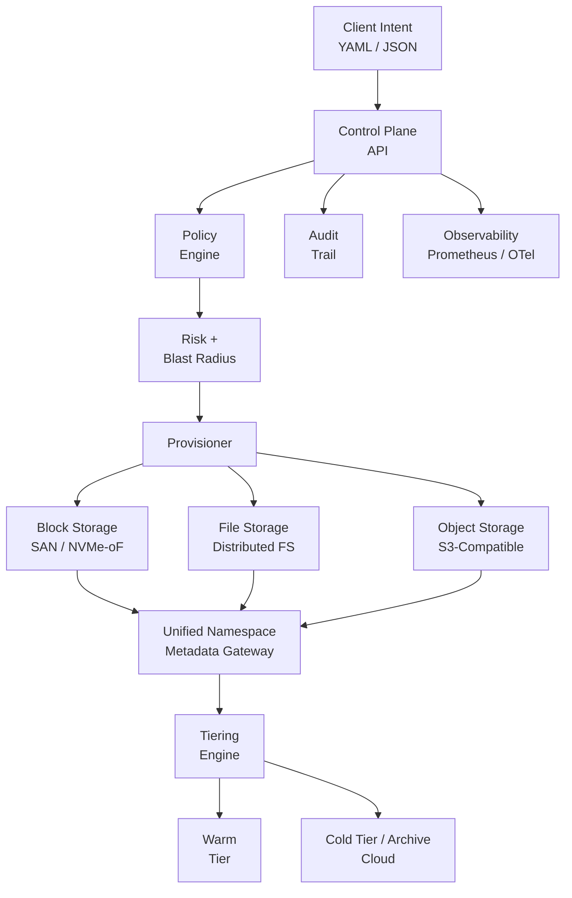

# 🛰️ Software‑Defined Storage Platform (SDSP)

> A generic, internal-style **software-defined storage platform** for **telemetry**, **manufacturing**, and **simulation** data at scale.
>
> **Intent → Policy → Provision → Observe → Tier → Audit**

---

## Why SDSP

Rocket programs generate data that doesn’t behave like “enterprise IT”:

- **Telemetry**: high-rate ingest, bursty peaks, strict integrity
- **Manufacturing**: CAD/PLM artifacts, machine logs, long retention, auditability
- **Simulation/HPC**: throughput-heavy reads, metadata pressure, parallel access

SDSP provides a single control plane to:
- provision **block / file / object** storage in a consistent way
- enforce **policy** (criticality, compliance, approval tiers)
- compute **blast radius** via dependency graph
- automate **hot→warm→cold** tiering across on‑prem + cloud
- emit **SOC2-friendly** audit logs and metrics

---

## 📐 Architecture

> GitHub Mermaid is strict about **one statement per line** and doesn’t always like HTML (`<br/>`) in node labels.
> This diagram uses simple labels to render reliably.



---

## 🧩 Components

- **Control Plane (FastAPI)**: accepts intents, enforces policy, coordinates provisioning
- **Metadata Gateway**: unified namespace façade + metadata routing (stubbed)
- **Telemetry Ingest**: example ingestion worker (stdout + optional local spool)
- **Tiering Engine**: lifecycle policies and movement decisions (hot/warm/cold)
- **Providers**: adapters for block/file/object backends (stubs; pluggable)
- **Deploy**: K8s base + overlays, Helm chart, Terraform skeleton

---

## 🚀 Quickstart (Local)

### 1) Start services

```bash
docker compose up --build
```

### 2) Health check

```bash
curl http://localhost:8000/health
```

### 3) Submit an intent

```bash
curl -X POST http://localhost:8000/v1/intents/apply \
  -H "Content-Type: application/json" \
  -d @examples/intents/telemetry-hot-tier.json
```

---

## 🧾 Intents (examples)

### Example 1 — Telemetry Hot Tier (NVMe-first, high criticality)

`examples/intents/telemetry-hot-tier.json`

```json
{
  "tenant": "mission-control",
  "workload": "telemetry",
  "criticality": "MISSION_CRITICAL",
  "storage": {
    "type": "block",
    "performance_tier": "hot",
    "capacity_tb": 200,
    "replication": 3,
    "protocol": "NVMe-oF"
  },
  "dependencies": ["telemetry-bus", "flight-analytics"]
}
```

### Example 2 — Manufacturing File Workspace (CAD + long retention)

```json
{
  "tenant": "factory",
  "workload": "manufacturing",
  "criticality": "HIGH",
  "storage": {
    "type": "file",
    "performance_tier": "warm",
    "capacity_tb": 500,
    "protocol": "NFS"
  },
  "retention": { "years": 7 }
}
```

### Example 3 — Simulation Dataset Cache (throughput-heavy)

```json
{
  "tenant": "simulation",
  "workload": "simulation",
  "criticality": "HIGH",
  "storage": {
    "type": "file",
    "performance_tier": "hot",
    "capacity_tb": 800,
    "protocol": "parallel-fs"
  }
}
```

### Example 4 — Cold Archive (object + lifecycle)

```json
{
  "tenant": "archive",
  "workload": "mixed",
  "criticality": "MEDIUM",
  "storage": {
    "type": "object",
    "performance_tier": "cold",
    "capacity_tb": 5000,
    "protocol": "S3"
  },
  "tiering": {
    "archive_after_days": 30,
    "delete_after_days": 3650
  }
}
```

---

## 🧠 Policy & Risk Model

Policy is defined in `services/control-plane/.sdsp/policy.yaml` and can enforce:
- minimum replication factor by criticality
- approval tiers
- encryption-at-rest requirement
- retention rules

Risk scoring is **explainable**:
- change magnitude (capacity / tier / protocol)
- criticality multiplier
- dependency blast radius

---

## 🔍 Observability & Audit

- **Prometheus metrics**: request count, risk tiers, provisioning latency
- **OpenTelemetry tracing**: stubbed (ready to wire)
- **Audit trail**: append-only JSONL with hash chaining (SOC2-friendly)

---

## 🏗 Deploy

- **Kubernetes**: `deploy/k8s` (base + dev/prod overlays)
- **Helm**: `deploy/helm/sdsp`
- **Terraform**: `deploy/terraform/aws`

---

## License
Apache-2.0
